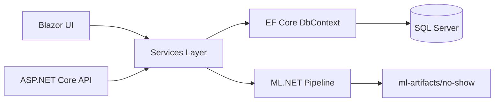

# ClinicManagementSystem

ClinicManagementSystem is a .NET 10 capstone prototype for outpatient clinic workflows.

It currently delivers end-to-end functionality for patient management, staff management, appointment scheduling with conflict detection, dashboard insights, deterministic seed data, and local ML.NET no-show risk prediction.

It now includes production-ready authentication and role-based authorization via ASP.NET Core Identity + EF Core.

## Implemented Scope (Current Prototype)

- Patient module: create, read, update, soft delete, search
- Staff module: create, read, update, soft delete
- Appointment module: create, read, update, delete (soft), status updates
- Scheduling conflict checks: prevents overlapping appointments for the same staff member or patient
- Dashboard module:
  - total patients
  - total appointments
  - today appointments
  - completed appointments
  - cancelled appointments
  - no-show count and no-show rate
  - appointment trend
  - staff workload summary
- Prediction module:
  - local ML.NET synthetic dataset generation
  - local ML.NET FastTree binary training and evaluation
  - no-show risk inference (ML model with fallback logic)
  - risk levels: Low, Medium, High
  - recommendation text for scheduling team actions

## Tech Stack

- .NET 10
- ASP.NET Core Web API
- Blazor Server (interactive server render mode)
- Entity Framework Core + SQL Server
- ML.NET (local only, no external AI APIs)

## Solution Structure

- [ClinicManagementSystem.API](ClinicManagementSystem.API): REST APIs
- [ClinicManagementSystem.Blazor](ClinicManagementSystem.Blazor): UI frontend
- [ClinicManagementSystem.Data](ClinicManagementSystem.Data): EF Core DbContext and seed logic
- [ClinicManagementSystem.Models](ClinicManagementSystem.Models): entities and DTOs
- [ClinicManagementSystem.Services](ClinicManagementSystem.Services): business and ML services

## Architecture Overview



More details: [docs/ARCHITECTURE.md](docs/ARCHITECTURE.md)

## Setup

### Prerequisites

- .NET SDK 10
- SQL Server (local or remote)

### Configure Connection Strings

Set ClinicDb in:

- [ClinicManagementSystem.API/appsettings.Development.json](ClinicManagementSystem.API/appsettings.Development.json)
- [ClinicManagementSystem.Blazor/appsettings.Development.json](ClinicManagementSystem.Blazor/appsettings.Development.json)

### Restore and Build

```powershell
dotnet restore
dotnet build --configuration Release
```

## Database and Seed Behavior

Startup behavior currently implemented in both API and Blazor:

1. Apply migrations if pending
2. Run development seed data idempotently
3. Run Identity seed idempotently (roles + development admin account)

Seed logic file:

- [ClinicManagementSystem.Data/DevelopmentDataSeeder.cs](ClinicManagementSystem.Data/DevelopmentDataSeeder.cs)

Seed details: [docs/SEED_DATA.md](docs/SEED_DATA.md)

## Authentication and Authorization

### Identity Storage

- ASP.NET Core Identity is backed by EF Core in [ClinicManagementSystem.Data/ClinicDbContext.cs](ClinicManagementSystem.Data/ClinicDbContext.cs)
- Custom Identity tables:
  - AppUsers
  - AppRoles
  - AppUserRoles
  - AppUserClaims
  - AppUserLogins
  - AppUserTokens
  - AppRoleClaims

### Seeded Roles

- Admin
- Doctor
- Receptionist

### Development Admin Credentials (Development Only)

- Email: admin@clinic.local
- Password: Admin@12345!

Do not use these credentials in staging/production.

### API Login Endpoint

- `POST /api/auth/login`
- Body:

```json
{
  "email": "admin@clinic.local",
  "password": "Admin@12345!"
}
```

Returns JWT token + user/role payload.

### Blazor Login/Logout

- Login page: `/login`
- Cookie auth login endpoint: `POST /account/login`
- Logout endpoint: `POST /account/logout`

Blazor pages use route-level `[Authorize]` and role constraints.

### Role Matrix

| Surface                 | Roles                       |
| ----------------------- | --------------------------- |
| API `/api/Patients`     | Admin, Doctor, Receptionist |
| API `/api/StaffMembers` | Admin                       |
| API `/api/Appointments` | Admin, Doctor, Receptionist |
| API `/api/Dashboard`    | Admin, Doctor               |
| API `/api/Predictions`  | Admin, Doctor, Receptionist |
| Blazor Dashboard (`/`)  | Admin, Doctor               |
| Blazor Patients         | Admin, Doctor, Receptionist |
| Blazor Appointments     | Admin, Doctor, Receptionist |
| Blazor Staff            | Admin                       |
| Blazor Prediction pages | Admin, Doctor, Receptionist |

### Authentication Audit Logging

Authentication events are written to `AuditLogs` with `EntityName = "Authentication"` for:

- LoginSuccess
- LoginFailed
- AccountLockedOut
- Logout

### AppSettings Guidance

Configure these keys in API settings (or environment variables):

- `Jwt:Key` (required, strong random secret in non-dev)
- `Jwt:Issuer`
- `Jwt:Audience`
- `Jwt:ExpiryMinutes`

For local development, defaults are provided in [ClinicManagementSystem.API/appsettings.Development.json](ClinicManagementSystem.API/appsettings.Development.json).

For staging/production, replace placeholders in:

- [ClinicManagementSystem.API/appsettings.Staging.json](ClinicManagementSystem.API/appsettings.Staging.json)
- [ClinicManagementSystem.API/appsettings.Production.json](ClinicManagementSystem.API/appsettings.Production.json)

## Run the App

### API

```powershell
dotnet run --project ClinicManagementSystem.API
```

### Blazor UI

```powershell
dotnet run --project ClinicManagementSystem.Blazor
```

## ML.NET Dataset Generation and Training

Implemented API endpoints:

- POST /api/Predictions/no-show/dataset?rows=1200
- POST /api/Predictions/no-show/train
- POST /api/Predictions/no-show/appointment/{appointmentId}?persist=true

PowerShell examples:

```powershell
Invoke-RestMethod -Method Post -Uri "https://localhost:5001/api/Predictions/no-show/dataset?rows=1200"
Invoke-RestMethod -Method Post -Uri "https://localhost:5001/api/Predictions/no-show/train"
```

Generated artifacts (local):

- Dataset CSV: [ml-artifacts/no-show/no_show_training_data.csv](ml-artifacts/no-show/no_show_training_data.csv)
- Model ZIP: [ml-artifacts/no-show/no_show_model.zip](ml-artifacts/no-show/no_show_model.zip)

ML documentation: [docs/ML.md](docs/ML.md)

## Measurable Prototype Evidence

### Seeded Data Volumes

Current deterministic seed targets:

- Patients: 20
- StaffMembers: 6
- Appointments: 45
- Notifications: 32
- VisitRecords: 16
- ClinicSettings: 1
- PredictionResults: seeded from high-risk appointments

### Implemented Modules

- PatientsController
- StaffMembersController
- AppointmentsController
- DashboardController
- PredictionsController

### ML Evaluation Outputs

Training endpoint returns:

- Accuracy
- Precision
- Recall
- F1Score
- AUC
- TrainRowCount
- TestRowCount
- DatasetPath
- ModelPath

### UI Evidence

- Dashboard KPI cards and trend/workload widgets
- Appointment conflict warnings in scheduling flow
- Appointment detail risk scoring with recommendation
- Dedicated ML metrics page at /predictions/metrics

## Current Status vs Planned Features

### Current

- Core clinic operations implemented and connected
- Deterministic seed data and ML scaffolding available
- Local inference integrated into appointment workflow

### Planned Next

- Expand model feature engineering with real historical data
- Add automated test suite coverage for services and controllers
- Add performance baseline captures and API latency dashboard

## Testing Notes

Current testing documentation: [docs/TESTING.md](docs/TESTING.md)
