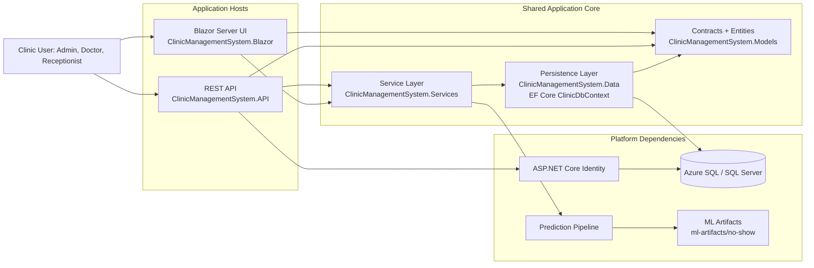
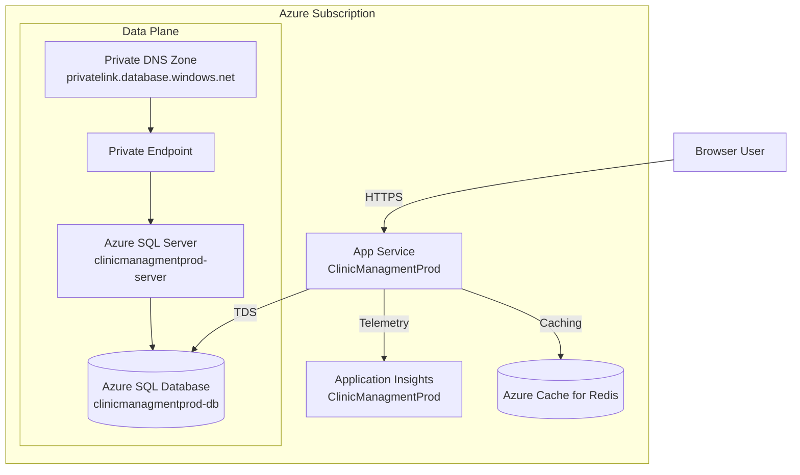

# Architecture

## Purpose

This document describes the implemented architecture for the Clinic Management System capstone, including runtime components, domain boundaries, cross-cutting concerns, and operational constraints.

## System Context

Clinic Management System is a modular monorepo with two application hosts sharing the same data and service layers:

- API host: ClinicManagementSystem.API
- UI host: ClinicManagementSystem.Blazor
- Shared service layer: ClinicManagementSystem.Services
- Shared persistence layer: ClinicManagementSystem.Data
- Shared contracts and entities: ClinicManagementSystem.Models

## High-Level Component View

## Azure Deployment View

## Layer Responsibilities

### Presentation Layer

- Blazor pages provide role-scoped user workflows:
  - patients
  - staff
  - appointments
  - dashboard
  - notifications
  - prediction lab and metrics
- API controllers expose authenticated REST endpoints with route-based module separation.

### Application/Service Layer

- Business services enforce scheduling and validation logic.
- Dashboard service aggregates operational metrics.
- Notification service handles reminder lifecycle and deduplication.
- Prediction service manages ML dataset generation, training, and inference.
- Audit and performance services capture operational evidence.

### Data Layer

- ClinicDbContext provides EF Core persistence and identity integration.
- Global query filters enforce soft-delete behavior.
- Entity relationships use restrict-delete behavior where appropriate.
- Timestamp updates are centralized in SaveChanges overrides.

## Key Runtime Flows

### Appointment Booking Flow

1. Client submits appointment request.
2. AppointmentService validates time range and conflict rules.
3. Service checks overlapping slots by staff and patient.
4. Record is persisted and audited.
5. Notification workflows can generate reminders.

### No-Show Prediction Flow

1. User requests direct or appointment-scoped prediction.
2. PredictionService loads local ML model when available.
3. If model is unavailable, fallback rule logic is used.
4. Risk output includes probability, level, and recommendation.
5. Optional persistence stores PredictionResult for appointment history.

### Dashboard Aggregation Flow

1. Dashboard endpoints request summary, trend, and workload data.
2. DashboardService aggregates appointment and patient datasets.
3. API returns chart-ready and table-ready structures.

## Role and Access Boundaries

The current implementation enforces role authorization primarily at controller and page level:

- Admin: full operations including staff and administrative endpoints
- Doctor: clinical and operational insight surfaces
- Receptionist: front-desk operational surfaces

Notable API restrictions:

- StaffMembersController: Admin only
- DashboardController: Admin and Doctor
- Performance reset endpoint: Admin only

## Cross-Cutting Concerns

### Security and Identity

- IdentityCore with EF stores for users, roles, claims, and tokens
- JWT bearer authentication in API
- Cookie authentication in Blazor
- Startup fail-fast when Jwt:Key is missing

### Auditing

- RequestAuditLoggingMiddleware records request-level activity
- Domain and authentication events write into AuditLogs

### Performance Monitoring

- PerformanceMonitoringMiddleware captures per-request timings
- In-memory summaries are exposed via API
- PerformanceSampleFlushHostedService persists samples to database

### Background Processing

- ReminderProcessingHostedService processes scheduled reminders
- PerformanceSampleFlushHostedService flushes performance telemetry

## Data Model Overview

Core entities in active use:

- AppUser
- Patient
- StaffMember
- Appointment
- VisitRecord
- Notification
- PredictionResult
- AuditLog
- ClinicSettings
- PerformanceSample

For field-level detail, see the database summary table in README.md.

## Environment Behavior

### API Host

- Testing environment uses EF InMemory provider.
- Other environments use SQL Server provider with retry-on-failure.
- Migrations and seeding run at startup under environment-aware logic.

### Blazor Host

- Uses SQL Server provider.
- Runs migrations and seeding during startup.
- Supports cookie-based interactive authentication.

## Architectural Limitations

- Current notification senders are logging adapters, not external provider integrations.
- Deployment automation and infrastructure-as-code are not yet part of this repository.
- ML workflow is local and optimized for capstone demonstration, not for regulated clinical deployment.
