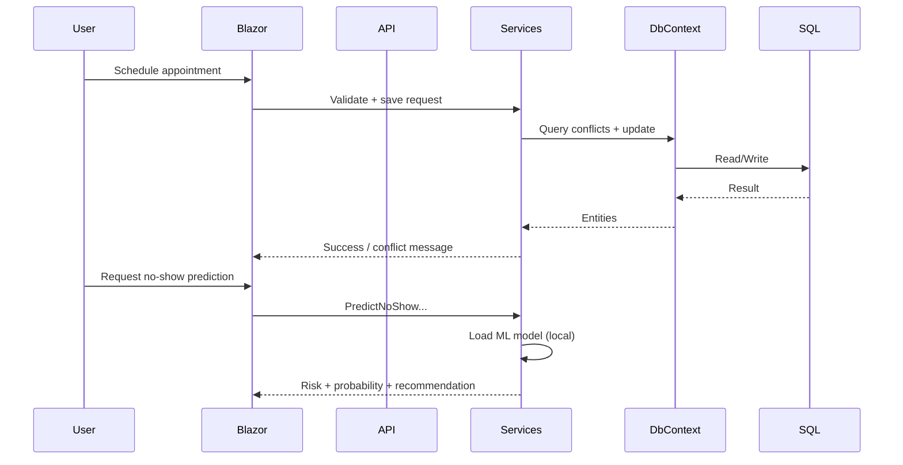

# Architecture

## Runtime Components

- Blazor frontend: [ClinicManagementSystem.Blazor](../ClinicManagementSystem.Blazor)
- Web API backend: [ClinicManagementSystem.API](../ClinicManagementSystem.API)
- Business services: [ClinicManagementSystem.Services](../ClinicManagementSystem.Services)
- Data access and seed: [ClinicManagementSystem.Data](../ClinicManagementSystem.Data)
- Shared entities and DTOs: [ClinicManagementSystem.Models](../ClinicManagementSystem.Models)
- Authentication and identity: ASP.NET Core Identity with EF Core

## Layer Responsibilities

- UI/API layers handle user interaction and endpoint routing.
- Services layer contains business logic, scheduling checks, dashboard aggregation, and ML workflows.
- Data layer provides EF Core DbContext and persistence.
- Models layer defines entities and DTO contracts used across projects.

## Data Flow

## Cross-Cutting Notes

- Soft-delete query filters are configured in DbContext.
- Startup applies pending migrations.
- Seed data runs idempotently at startup.
- Identity roles and development admin are seeded idempotently at startup.
- ML inference is local with ML.NET and model files under [ml-artifacts/no-show](../ml-artifacts/no-show).

## Authentication Architecture

- `AppUser` is integrated with ASP.NET Core Identity (`IdentityUser<Guid>`).
- API uses JWT bearer authentication (`/api/auth/login`).
- Blazor uses Identity application cookies (`/account/login`, `/account/logout`).
- Role-based authorization is enforced in API controllers and Blazor route attributes.
- Authentication-related events are persisted in `AuditLogs`.
