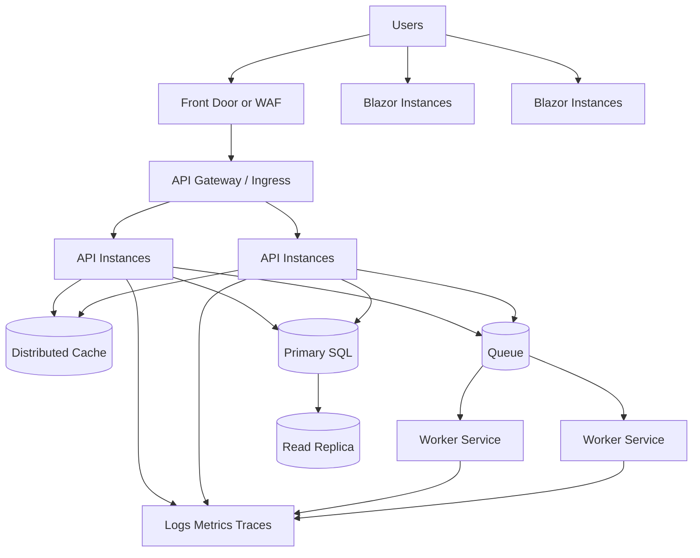

# Distributed Scaling Overview

## Purpose

This guide explains how to evolve ClinicManagementSystem from a single-region, app-service style deployment into a distributed, scalable, and resilient platform.

Use this file first to understand target state and implementation order. Then execute detailed steps from:

- SCALING_PHASE_1_FOUNDATION.md
- SCALING_PHASE_2_DISTRIBUTED_RUNTIME.md
- SCALING_PHASE_3_OPERATIONS_AND_DR.md
- SCALING_TOOLS_REFERENCE.md

## Current State Summary

Based on existing project docs:

- Separate API and Blazor hosts already exist.
- Shared service and data layers are in place.
- Background processing runs in-process hosted services.
- Deployment docs are oriented to single-region capstone hosting.

This means the system has good modular boundaries but still needs distributed runtime patterns.

## Target State Summary

The distributed target state has these characteristics:

1. Independent scaling of API and Blazor compute.
2. Stateless app instances and externalized state.
3. Queue-driven background processing workers.
4. Scalable data tier with caching and read/write strategy.
5. Full observability with SLO-driven autoscale.
6. Safe release process with canary/blue-green.
7. Zone redundancy and multi-region disaster recovery.

## Reference Architecture

## Implementation Sequence

Use this sequence to reduce risk:

1. Phase 1: foundation and baseline observability.
2. Phase 2: distributed runtime and horizontal scaling.
3. Phase 3: reliability, multi-region, and operations maturity.

## Tooling Decisions

Use these primary tools:

- Azure CLI (az): day-to-day cloud operations.
- Azure Developer CLI (azd): environment-driven provisioning and deployment.
- Terraform or Bicep: repeatable infrastructure as code.
- GitHub Actions or Azure DevOps: CI/CD and gated deployments.
- Application Insights and Log Analytics: telemetry and alerting.
- k6 or Azure Load Testing: load and stress validation.

## Exit Criteria

You are ready for production-scale operation when:

1. API and UI can scale independently under load.
2. Background work remains reliable during instance restarts.
3. SLO alerts are active and tested.
4. Deployments can roll back automatically on regressions.
5. Recovery runbooks are tested and documented.
